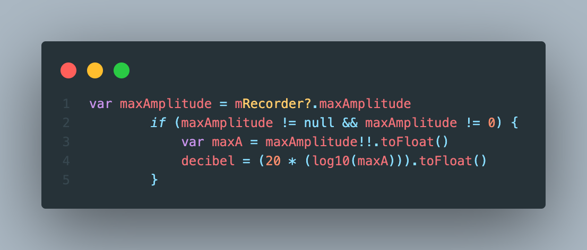

# Waldläufer Prototype: Android
Waldläufer app prototype for Wearable Computing WS22/23

This app is the android Kotlin prototype of the iOS Waldläufer with the possibility to determine the current location using GPS, to record the noise level as well as to suggest a feeling based on the noise level, heartrate and activity.

## Noise level
The noise gets recorded with the microphone using with the Android MediaRecorder for 10 seconds. The output format is THREE_GPP and the audio encoder is AMR_NB.

The maximum noise in decibel gets calculated from the max. amplitude:

We estimate one of the following feelings of the user at the current location with the current sound level: 😀, 🙂, 🙁, 😞

The rating is based on [this scale](https://www.noisyplanet.nidcd.nih.gov/sites/noisyplanet/files/Documents/Publications/HowLoudTooLoudBookmark.pdf) from the U.S. Department of Health & Human Services.

## Health and Activity
We wanted to try to include health and activity data in our feeling estimation to make better suggestions.

**Assumption:** When a person has a heart rate above the normal range of 60 - 100 bpm (according to the [British Heart Foundation](https://www.bhf.org.uk/informationsupport/heart-matters-magazine/medical/ask-the-experts/pulse-rate)) and is not active, they might be stressed and feel worse than initially estimted.

The best way to get health and activity data from an Android device we found is [GoogleFit](https://www.google.com/fit/). It includes data recorded from the mobile device as well as data from many different sports apps and watches.
Unfortunately GoogleFit still does not provide enough data to predict the stress level, therefore we decided to try to use heart rate and activity to distinguish a generally elevated heart rate from a heart reate elvated due to activity.

### GoogleFit data
#### Heart points
[Heart Points](https://developers.google.com/fit/datatypes/activity#heart_points) get calculated from the heart rate, Metabolic Equivalent of Task (MET) values or walkign speed. The number of Heart Points earned depends on the intensity of the activity.     
Example with heart rate:   
- 1 HP (Low-medium intensity activity): 1 minute of activity at >50% maximum heart rate
- 2 HPs (High intensity activity): 1 minute of activity at >70% max heart rate

#### Move minutes
[Move Minutes](https://developers.google.com/fit/datatypes/activity#move_minutes) can be earned by moving and doing activities.   
Example with going for a walk: Google Fit awards one Move Minute every time they take at least 30 steps within 60 seconds.

### Activity
We assume an user was active when in the last 30 minutes:
- he moved at least 10 minutes
- and has earned at least 20 heart points

### Feeling suggestion
If a user has a heart rate in the normal range or it is elevated and we detected an activity with Google Fit, the feeling suggestion from the sound level stays the same.

If the user has a higher heart rate than 100 and we detect no activity, the user might be stressed or might not be feeling good. Therefore we rate the feeling lower.

## Demos
Normal heart rate:
https://user-images.githubusercontent.com/48798335/214076065-42fc5f9f-0118-4bfc-b4dd-7ed501088343.mp4

Elevated heart rate without activity: https://user-images.githubusercontent.com/48798335/214080572-9846bbfd-1315-46d7-aead-bf5a038d2732.mp4

Elevated heart rate with activity: https://user-images.githubusercontent.com/48798335/214076218-b5a5132b-37dd-4827-ae56-08ba49fa8211.mp4

## Testing
As Goolge Fit includes sensitive data and this app is not verified by Google, the feeling suggestion with GoogleFit is only testable if the Google Account gets added in the Google API console.
